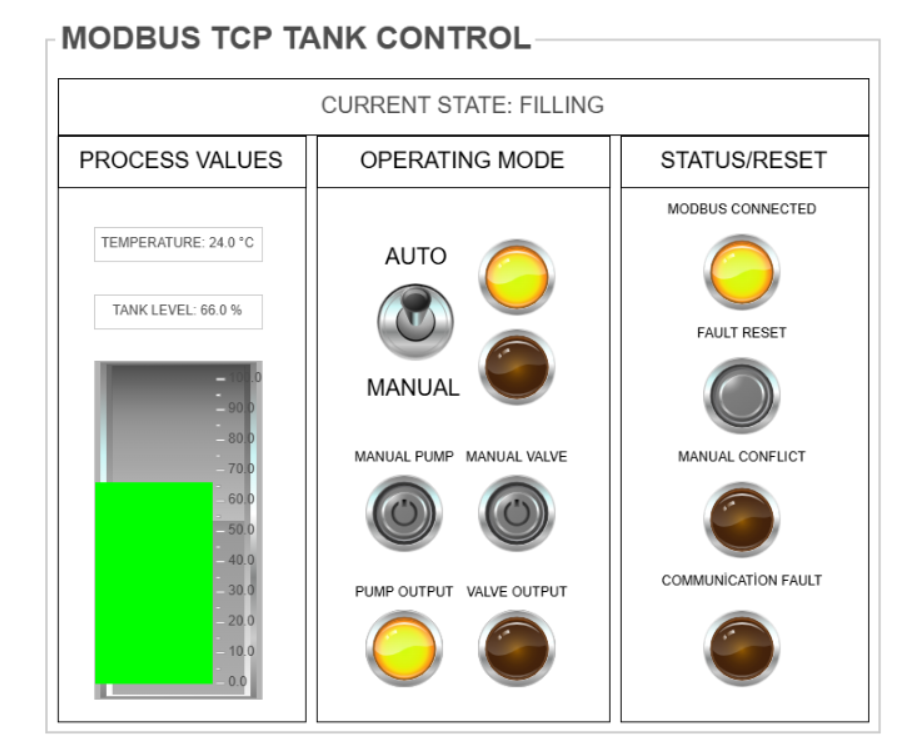
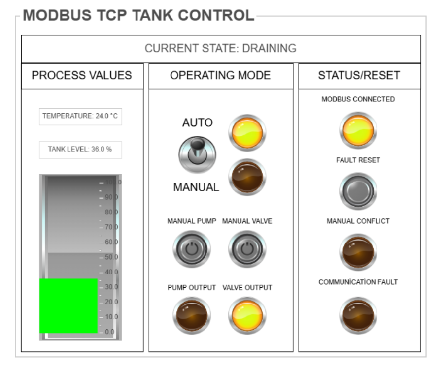
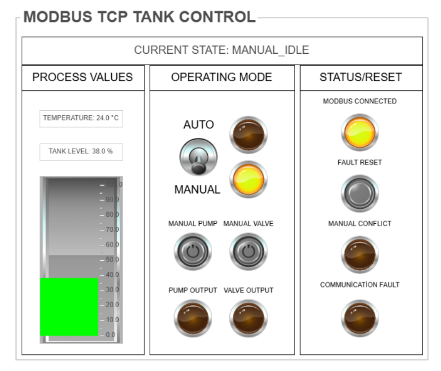
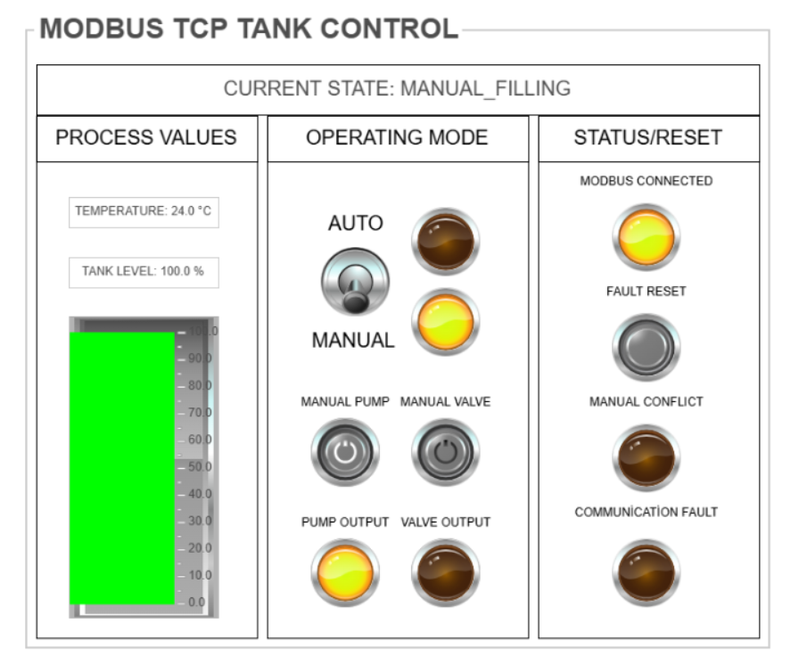
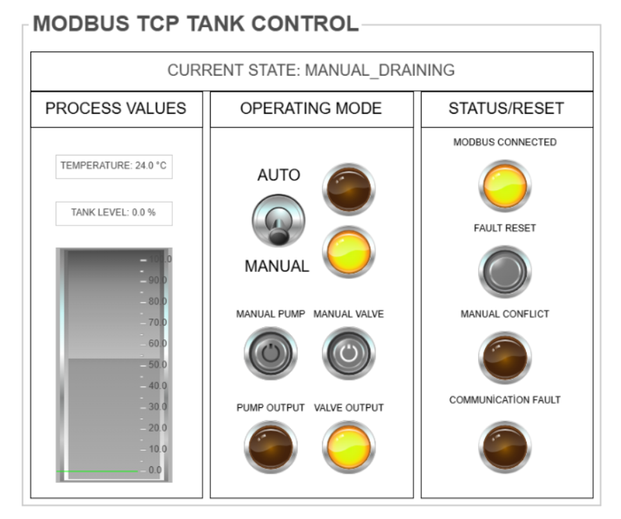
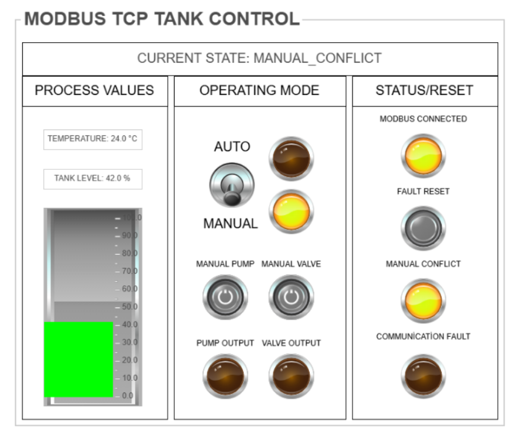
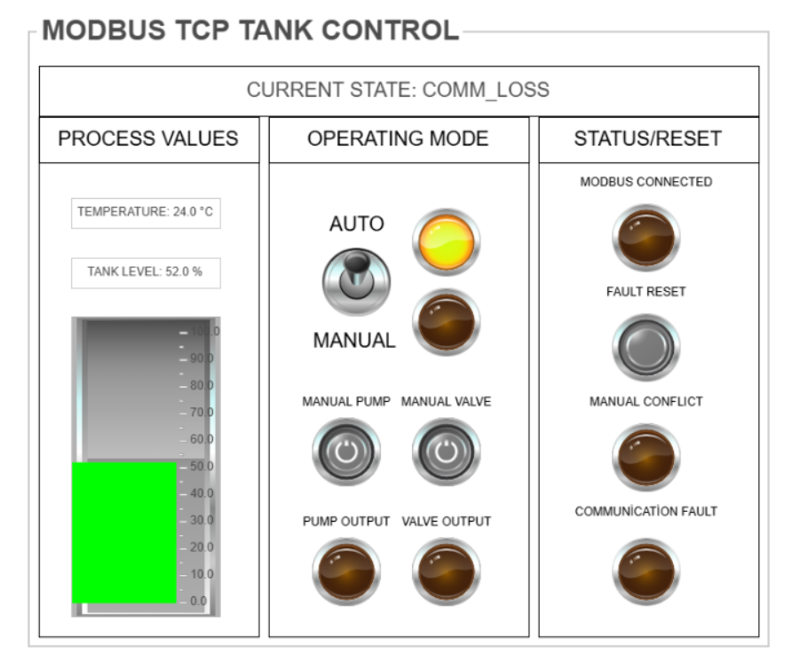
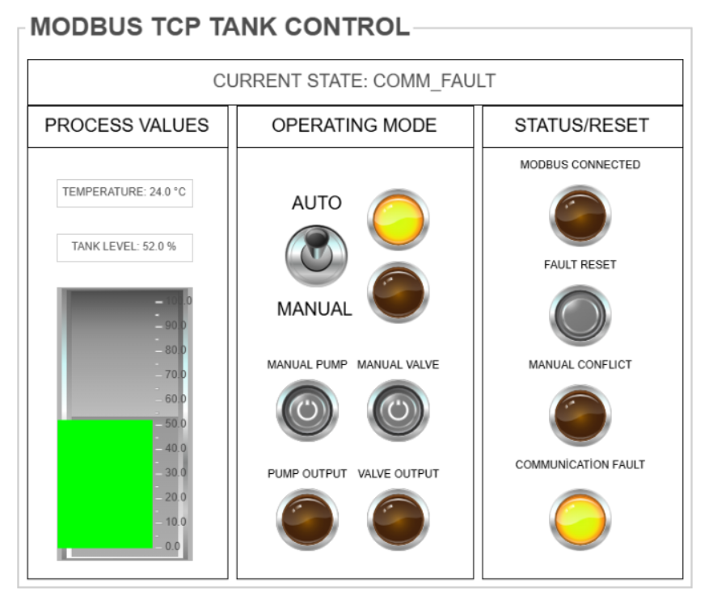

**CODESYS Modbus TCP Tank Control**

A virtual tank-control project demonstrating Modbus TCP communication between a CODESYS PLC application and a Python-based process simulator.

CODESYS operates as the Modbus TCP client and controls the simulated tank through pump and valve commands. Python operates as the Modbus TCP server and updates the virtual tank level according to these commands.

**Main Features**

- Modbus TCP communication between CODESYS and Python
- Structured Text programming
- State-machine-based control logic
- Automatic and manual operating modes
- Communication-loss detection
- Latched communication fault with reset handling
- Safe pump and valve outputs
- Virtual tank-level simulation in Python

**Technologies**

- CODESYS Control Win V3 x64
- IEC 61131-3 Structured Text
- Python 3
- pyModbusTCP 0.3.0
- Modbus TCP

**Example HMI Screen**

**Operating States**

The screenshots below show all operating states except `INIT`, which is only used as a short transition state.

**FILLING**

**DRAINING**

**MANUAL_IDLE**

**MANUAL_FILLING**

**MANUAL_DRAINING**

**MANUAL_CONFLICT**

**COMM_LOSS**

**COMM_FAULT**

**Repository Contents**

- `codesys/codesys-modbus-tcp-tank-control.projectarchive`: Complete CODESYS project archive
- `codesys/source/E_TankState.st`: State enumeration
- `codesys/source/PLC_PRG.st`: Main Structured Text control program
- `python-server/virtual_slave.py`: Python-based Modbus TCP server and process simulation
- `docs/`: HMI screenshots for all operating states
- `requirements.txt`: Required Python package version

**Running the Project**

1. Restore the CODESYS project archive.
2. Start CODESYS Control Win.
3. Start the Python server with `python python-server/virtual_slave.py`.
4. Log in to the CODESYS runtime and run the PLC application.
5. Observe the HMI screens and the state transitions.

Connection settings:

- IP address: `127.0.0.1`
- Port: `502`
